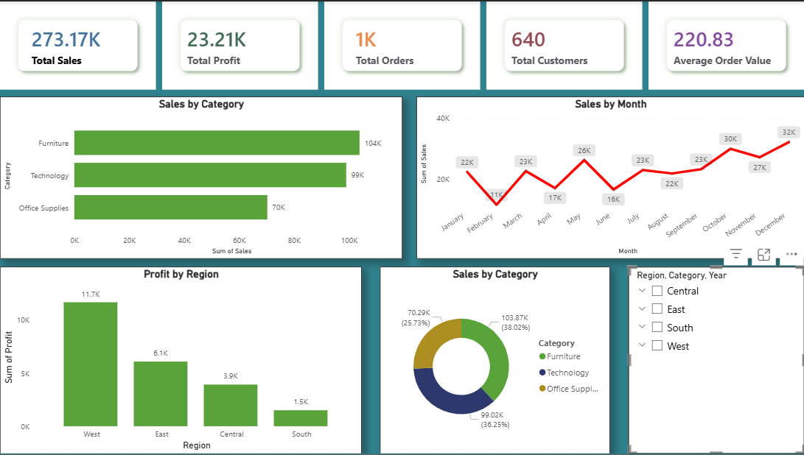

# E-Commerce Sales Analytics Dashboard

## Project Overview
Developed an interactive E-Commerce Sales Analytics Dashboard using Power BI to analyze sales, profit, orders, and customer trends.

## Features
- ETL process using Power Query
- KPI Cards
- Sales Trend Analysis
- Region-wise Profit Analysis
- Interactive Slicers
- DAX Measures

## Tools Used
- Power BI
- Power Query
- DAX
- Excel/CSV

## Dashboard Preview

## Key Insights
- Technology category generated highest sales
- West region contributed maximum profit
- Seasonal sales trends identified using monthly analysis